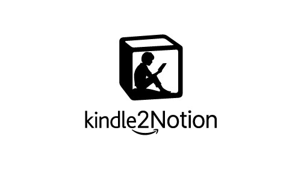

<!-- PROJECT OVERVIEW -->
<p align="center">
  
</p>
<!-- <h1 align="center">Kindle2Notion</h1> -->
<p align="center">
  A program to copy all your Kindle highlights and notes to a page in Notion. 
  <br />
  <a href="https://github.com/paperboi/Kindle2Notion">Explore the docs</a>
  ·
  <a href="https://github.com/paperboi/Kindle2Notion/issues">File issues and feature requests here</a>
</p>
<p align -"center>
  If you found this script helpful or appreciate my work, you can support me here:
</p>
<p align="center">
  <a href="https://www.buymeacoffee.com/jeffreyjacob" target="_blank"></a>
</p>

[![Contributors][contributors-shield]][contributors-url]
[![Forks][forks-shield]][forks-url]
[![Stargazers][stars-shield]][stars-url]
[![Issues][issues-shield]][issues-url]
[![MIT License][license-shield]][license-url]
[![LinkedIn][linkedin-shield]][linkedin-url]

<!-- TABLE OF CONTENTS -->
## Table of Contents

- [Table of Contents](#table-of-contents)
- [About The Project](#about-the-project)
- [Getting Started](#getting-started)
  - [Prerequisites](#prerequisites)
  - [Setup & Installation](#setup--installation)
- [Usage](#usage)
- [Roadmap](#roadmap)
- [Contributing](#contributing)
- [License](#license)
- [Contact](#contact)


<!-- ABOUT THE PROJECT -->
## About The Project

![Kindle2Notion Demo][product-demo]

A Python script to export all the clippings from your Kindle device to a page in Notion. Run this script whenever you plug in your Kindle device to your PC. The underlying idea behind this code is to marry the solitary reading experience of a Kindle with the note-taking capabilities of a cloud-based service like Notion.

A key inspiration behind this project was the notes saving feature on Google Play Books, which automatically syncs all your highlights from a book hosted on the service to a Google Doc in real time. I wanted a similar feature for my Kindle and this project is one step towards a solution for this problem.

**Intended for**
- Avid readers who would want to browse through their prior reads and highlights anytime anywhere.
- For those who take notes alongside their highlights.


<!-- GETTING STARTED -->
## Getting Started

To get a local copy up and running follow these simple steps.

### Prerequisites

* A Kindle device.
* A Notion account to store your links.
* Python 3 on your system to run the code.

### Setup & Installation
 
1. Clone this repository.
    ```sh
    git clone https://github.com/paperboi/Kindle2Notion.git
    ```
2. Navigate to the directory and install the pre-requisite packages using
   ```sh
   pip install -r requirements.txt
   ```


<!-- USAGE EXAMPLES -->
## Usage

1. Plug in your Kindle device to your PC.
2. Duplicate this [database template](https://www.notion.so/imesut/2613943b8afa41f1b99c211b6cad7a90?v=91095371fbd4435cae44dd9490fdeeb1) to your Notion workspace.
3. Since this code requires access of non-public pages, an authentication token from your Notion page is required. This token is stored in the `token_v2` cookie. This can be found in the *Storage* tab of your browser's developer tools.
   - For Chrome: Open Developer Tools (*Menu > Other tools > Developer Tools*), navigate to Application tab and go to *Storage\Cookies* to find the token.
4. Store the path to your `MyClippings.txt` file, the address to your database and the `token_v2` value as `CLIPPINGS_FILE`, `NOTION_TABLE_ID` and `NOTION_TOKEN` respectively in a `.env` file (example provided in the repo) in the same directory you have cloned this repository to.
   - Set `ENABLE_HIGHLIGHT_DATE` to **False**, if you don't want to see **"date added"** information.
   - Set `ENABLE_BOOK_COVER` to **False**, if you don't want to store book covers to your databases.
5. To execute the script, navigate to the directory and run
   ```sh
   python kindle2notion.py
   ```
[**Note:** This code was tested on a 4th Gen Kindle Paperwhite.]


<!-- ROADMAP -->
## Roadmap

See the [open issues](https://github.com/paperboi/Kindle2Notion/issues) for a list of proposed features (and known issues).


<!-- CONTRIBUTING -->
## Contributing

<!-- Contributions are what make the open source community such an amazing place to be learn, inspire, and create. -->
Any contributions you make are **greatly appreciated**.

1. Fork the Project
2. Create your Feature Branch (`git checkout -b feature/AmazingFeature`)
3. Commit your Changes (`git commit -m 'Add some AmazingFeature'`)
4. Push to the Branch (`git push origin feature/AmazingFeature`)
5. Open a Pull Request


<!-- LICENSE -->
## License

Distributed under the MIT License. See [LICENSE][license-url] for more information.


<!-- CONTACT -->
## Contact

Jeffrey Jacob
- [Twitter](https://twitter.com/jeffreysamjacob)
- [Email](mailto:jeffreysamjacob@gmail.com)
- [LinkedIn](https://www.linkedin.com/in/jeffreysamjacob/)


[contributors-shield]: https://img.shields.io/github/contributors/paperboi/Kindle2Notion.svg?style=flat-square
[contributors-url]: https://github.com/paperboi/Kindle2Notion/graphs/contributors
[forks-shield]: https://img.shields.io/github/forks/paperboi/Kindle2Notion.svg?style=flat-square
[forks-url]: https://github.com/paperboi/Kindle2Notion/network/members
[stars-shield]: https://img.shields.io/github/stars/paperboi/Kindle2Notion.svg?style=flat-square
[stars-url]: https://github.com/paperboi/Kindle2Notion/stargazers
[issues-shield]: https://img.shields.io/github/issues/paperboi/Kindle2Notion.svg?style=flat-square
[issues-url]: https://github.com/paperboi/Kindle2Notion/issues
[license-shield]: https://img.shields.io/github/license/paperboi/Kindle2Notion.svg?style=flat-square
[license-url]: https://github.com/paperboi/kindle2notion/blob/master/LICENSE
[linkedin-shield]: https://img.shields.io/badge/-LinkedIn-black.svg?style=flat-square&logo=linkedin&colorB=555
[linkedin-url]: https://www.linkedin.com/in/jeffreysamjacob/
[product-demo]: demo.gif
[bmac]: bmac.png
[bmac-url]: https://www.buymeacoffee.com/jeffreyjacob